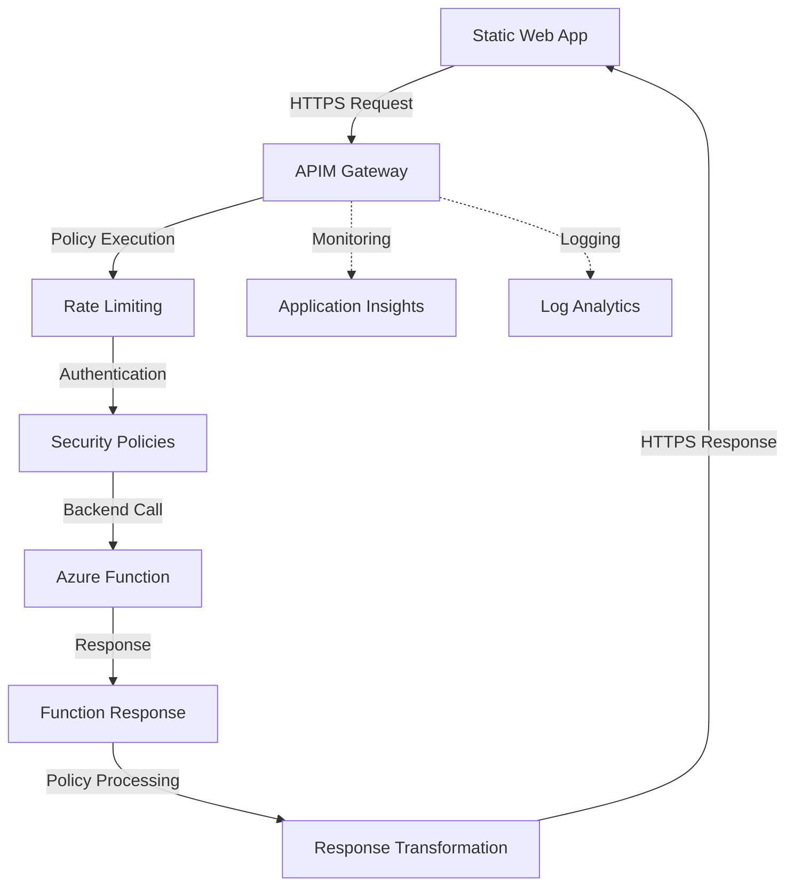

# Azure API Management (APIM) Provisioning Guide

## Azure Function: helloworldfunc09231920

This document outlines the provisioning of Azure API Management for the Book Borrowing System Azure Function App.

---

## 🏗️ APIM Service Configuration

### Basic Information
- **APIM Service Name**: `book-system-apim`
- **Resource Group**: `dev-swa-rg`
- **Location**: `Canada Central`
- **Pricing Tier**: `Developer` (for development/testing)
- **Capacity**: `1 unit`

### Service Endpoints
- **Gateway URL**: `https://book-system-apim.azure-api.net`
- **Developer Portal**: `https://book-system-apim.developer.azure-api.net`
- **Management Endpoint**: `https://book-system-apim.management.azure-api.net`

---

## 🔌 Backend Configuration

### Azure Function Backend
```yaml
Backend Name: helloworldfunc-backend
Backend URL: https://helloworldfunc09231920.azurewebsites.net
Protocol: HTTPS
Runtime URL: /api
```

### Authentication
- **Type**: Function Key Authentication
- **Header Name**: `x-functions-key`
- **Key Source**: Azure Function App Keys

---

## 🚦 API Configuration

### API Definition
```yaml
API Name: Book Borrowing System API
API URL Suffix: /books
Version: v1
Protocol: HTTPS
```

### Operations

#### Hello World Endpoint
```yaml
Operation: GET /hello
Display Name: Hello World
Description: Basic health check and greeting endpoint
Backend: helloworldfunc-backend/hello
Query Parameters:
  - name (string, optional): Name for personalized greeting
Response: Plain text greeting message
```

---

## 🌐 Outbound Traffic Configuration

### Outbound IP Addresses
APIM will use these IP ranges for outbound connections:

#### Canada Central Region IPs
```
Outbound IPs (APIM to Backend):
- 20.48.202.160/32
- 20.48.138.88/32
- 20.48.139.0/32
- 52.228.113.13/32
- 52.228.116.19/32
```

### Network Security Rules

#### Required Outbound Rules
```yaml
# Azure Function Communication
- Destination: helloworldfunc09231920.azurewebsites.net
  Protocol: HTTPS (443)
  Purpose: Backend API calls

# Azure Management
- Destination: management.azure.com
  Protocol: HTTPS (443)
  Purpose: Azure Resource Manager calls

# Azure Storage (for APIM internal storage)
- Destination: *.blob.core.windows.net
  Protocol: HTTPS (443)
  Purpose: Configuration and logging storage

# Key Vault (if using)
- Destination: *.vault.azure.net
  Protocol: HTTPS (443)
  Purpose: Certificate and secret management
```

#### Network Security Group Rules
```json
{
  "securityRules": [
    {
      "name": "Allow-APIM-to-Function",
      "properties": {
        "protocol": "Tcp",
        "sourceAddressPrefix": "ApiManagement",
        "destinationAddressPrefix": "AzureCloud.CanadaCentral",
        "sourcePortRange": "*",
        "destinationPortRange": "443",
        "access": "Allow",
        "priority": 100,
        "direction": "Outbound"
      }
    },
    {
      "name": "Allow-APIM-Management",
      "properties": {
        "protocol": "Tcp",
        "sourceAddressPrefix": "ApiManagement",
        "destinationAddressPrefix": "AzureResourceManager",
        "sourcePortRange": "*",
        "destinationPortRange": "443",
        "access": "Allow",
        "priority": 110,
        "direction": "Outbound"
      }
    }
  ]
}
```

---

## 🔐 Security Configuration

### CORS Policy
```xml
<cors allow-credentials="false">
    <allowed-origins>
        <origin>*</origin>
    </allowed-origins>
    <allowed-methods>
        <method>GET</method>
        <method>POST</method>
        <method>OPTIONS</method>
    </allowed-methods>
    <allowed-headers>
        <header>Content-Type</header>
        <header>Authorization</header>
        <header>Accept</header>
    </allowed-headers>
</cors>
```

**Note**: Cannot mix wildcard origin (`*`) with specific origins. Use either `*` for all origins or specify exact origins.

### Rate Limiting Policy
```xml
<rate-limit-by-key calls="100" renewal-period="60" counter-key="@(context.Request.IpAddress)" />
```

### Authentication Policies
```xml
<authentication-managed-identity resource="https://management.azure.com/" />
```

---

## 📊 Monitoring and Logging

### Application Insights Configuration
```yaml
Application Insights: book-system-apim-insights
Resource Group: dev-swa-rg
Location: Canada Central
```

### Key Metrics to Monitor
- **Request Volume**: Total API calls per minute
- **Response Time**: Average response time (target: <500ms)
- **Error Rate**: 4xx and 5xx error percentages
- **Backend Health**: Function App availability

### Log Analytics Queries
```kusto
// API Request Volume
ApiManagementGatewayLogs
| where TimeGenerated > ago(1h)
| summarize count() by bin(TimeGenerated, 5m)

// Error Rate Analysis
ApiManagementGatewayLogs
| where TimeGenerated > ago(24h)
| where ResponseCode >= 400
| summarize ErrorCount = count() by ResponseCode, OperationName

// Backend Response Times
ApiManagementGatewayLogs
| where TimeGenerated > ago(1h)
| summarize avg(BackendResponseTime) by bin(TimeGenerated, 5m)
```

---

## 🚀 Deployment Scripts

### Azure CLI Deployment
```bash
#!/bin/bash

# Variables
RESOURCE_GROUP="dev-swa-rg"
APIM_NAME="book-system-apim"
LOCATION="canadacentral"
FUNCTION_APP="helloworldfunc09231920"

# Create APIM instance
az apim create \
  --resource-group $RESOURCE_GROUP \
  --name $APIM_NAME \
  --location $LOCATION \
  --publisher-email "your-email@domain.com" \
  --publisher-name "Book System Admin" \
  --sku-name Developer \
  --sku-capacity 1

# Get Function App host key
FUNCTION_KEY=$(az functionapp keys list \
  --resource-group $RESOURCE_GROUP \
  --name $FUNCTION_APP \
  --query "functionKeys.default" \
  --output tsv)

# Create backend
az apim backend create \
  --resource-group $RESOURCE_GROUP \
  --service-name $APIM_NAME \
  --backend-id "helloworldfunc-backend" \
  --url "https://$FUNCTION_APP.azurewebsites.net/api" \
  --protocol http \
  --credentials-header x-functions-key=$FUNCTION_KEY

# Create API
az apim api create \
  --resource-group $RESOURCE_GROUP \
  --service-name $APIM_NAME \
  --api-id "book-borrowing-api" \
  --path "/books" \
  --display-name "Book Borrowing System API" \
  --protocols https

# Create hello world operation
az apim api operation create \
  --resource-group $RESOURCE_GROUP \
  --service-name $APIM_NAME \
  --api-id "book-borrowing-api" \
  --operation-id "hello-world" \
  --method GET \
  --url-template "/hello" \
  --display-name "Hello World"

# Create OPTIONS operation for CORS preflight
az apim api operation create \
  --resource-group $RESOURCE_GROUP \
  --service-name $APIM_NAME \
  --api-id "book-borrowing-api" \
  --operation-id "hello-world-options" \
  --method OPTIONS \
  --url-template "/hello" \
  --display-name "Hello World Options"

# Apply CORS policy via REST API
ACCESS_TOKEN=$(az account get-access-token --query "accessToken" --output tsv)
curl -X PUT "https://management.azure.com/subscriptions/$SUBSCRIPTION_ID/resourceGroups/$RESOURCE_GROUP/providers/Microsoft.ApiManagement/service/$APIM_NAME/apis/book-borrowing-api/policies/policy?api-version=2021-08-01" \
  -H "Authorization: Bearer $ACCESS_TOKEN" \
  -H "Content-Type: application/vnd.ms-azure-apim.policy.raw+xml" \
  -d '<policies>
  <inbound>
    <cors allow-credentials="false">
      <allowed-origins>
        <origin>*</origin>
      </allowed-origins>
      <allowed-methods>
        <method>GET</method>
        <method>POST</method>
        <method>OPTIONS</method>
      </allowed-methods>
      <allowed-headers>
        <header>Content-Type</header>
        <header>Authorization</header>
        <header>Accept</header>
      </allowed-headers>
    </cors>
    <set-backend-service base-url="https://$FUNCTION_APP.azurewebsites.net/api" />
    <set-header name="x-functions-key" exists-action="override">
      <value>$FUNCTION_KEY</value>
    </set-header>
  </inbound>
  <backend>
    <base />
  </backend>
  <outbound>
    <base />
  </outbound>
  <on-error>
    <base />
  </on-error>
</policies>'
```

### ARM Template
```json
{
  "$schema": "https://schema.management.azure.com/schemas/2019-04-01/deploymentTemplate.json#",
  "contentVersion": "1.0.0.0",
  "parameters": {
    "apimServiceName": {
      "type": "string",
      "defaultValue": "book-system-apim"
    }
  },
  "resources": [
    {
      "type": "Microsoft.ApiManagement/service",
      "apiVersion": "2021-08-01",
      "name": "[parameters('apimServiceName')]",
      "location": "[resourceGroup().location]",
      "sku": {
        "name": "Developer",
        "capacity": 1
      },
      "properties": {
        "publisherEmail": "admin@booksystem.com",
        "publisherName": "Book System Admin"
      }
    }
  ]
}
```

---

## 📋 Pre-Deployment Checklist

### Prerequisites
- [ ] Azure Function App deployed and running
- [ ] Function App keys accessible
- [ ] Resource Group permissions configured
- [ ] Network security groups configured

### Validation Steps
- [ ] Test Function App endpoints directly
- [ ] Verify outbound network connectivity
- [ ] Confirm CORS settings
- [ ] Test rate limiting policies

### Post-Deployment Verification
- [ ] APIM gateway responds to health checks
- [ ] All API operations return expected responses
- [ ] Monitoring and logging configured
- [ ] Developer portal accessible

---

## 🌊 Traffic Flow Diagram



---

## 📞 Support and Troubleshooting

### Common Issues

#### 1. CORS Errors (NetworkError when attempting to fetch resource)
**Symptoms**:
- Browser shows "TypeError: NetworkError when attempting to fetch resource"
- 404 errors on OPTIONS requests
- Missing CORS headers

**Solutions**:
```bash
# 1. Create OPTIONS operation for CORS preflight
az apim api operation create \
  --resource-group dev-swa-rg \
  --service-name book-system-apim \
  --api-id "book-borrowing-api" \
  --operation-id "hello-world-options" \
  --method OPTIONS \
  --url-template "/hello" \
  --display-name "Hello World Options"

# 2. Apply CORS policy (cannot mix * with specific origins)
ACCESS_TOKEN=$(az account get-access-token --query "accessToken" --output tsv)
curl -X PUT "https://management.azure.com/subscriptions/176a9b8c-ce4f-49c9-adc1-0b464552aa81/resourceGroups/dev-swa-rg/providers/Microsoft.ApiManagement/service/book-system-apim/apis/book-borrowing-api/policies/policy?api-version=2021-08-01" \
  -H "Authorization: Bearer $ACCESS_TOKEN" \
  -H "Content-Type: application/vnd.ms-azure-apim.policy.raw+xml" \
  -d '<policies><inbound><cors allow-credentials="false"><allowed-origins><origin>*</origin></allowed-origins><allowed-methods><method>GET</method><method>POST</method><method>OPTIONS</method></allowed-methods><allowed-headers><header>Content-Type</header><header>Authorization</header><header>Accept</header></allowed-headers></cors><set-backend-service base-url="https://helloworldfunc09231920.azurewebsites.net/api" /><set-header name="x-functions-key" exists-action="override"><value>YOUR_FUNCTION_KEY</value></set-header></inbound><backend><base /></backend><outbound><base /></outbound><on-error><base /></on-error></policies>'

# 3. Test CORS preflight
curl -X OPTIONS "https://book-system-apim.azure-api.net/books/hello" \
  -H "Origin: https://your-static-web-app.azurestaticapps.net" \
  -H "Access-Control-Request-Method: GET" -v
```

#### 2. Other Common Issues
1. **502 Bad Gateway**: Check Function App availability and keys
2. **Rate Limiting**: Adjust rate limiting policies if needed
3. **Authentication Failures**: Validate Function App keys

### Useful Commands
```bash
# Check APIM service status
az apim show --resource-group dev-swa-rg --name book-system-apim

# Test Hello World API endpoint
curl -X GET "https://book-system-apim.azure-api.net/books/hello"
curl -X GET "https://book-system-apim.azure-api.net/books/hello?name=YourName"

# View logs
az monitor activity-log list --resource-group dev-swa-rg
```

### Contact Information
- **Technical Lead**: System Administrator
- **Azure Support**: Standard Support Plan
- **Emergency Contact**: On-call engineer

---

## 📝 Change Log

| Date | Version | Changes |
|------|---------|---------|
| 2025-09-23 | 1.0 | Initial APIM provisioning document |

---

*This document is automatically generated and should be kept up-to-date with infrastructure changes.*